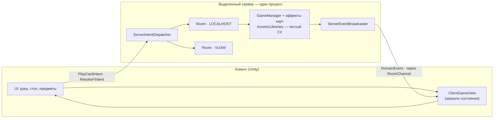

# ScaryTales

Сетевая карточная игра на **2–4 человека**. Один игрок создаёт комнату, получает код из четырёх
букв, диктует его друзьям — и все садятся за один стол. Ни IP, ни проброса портов, ни Hamachi.


Партия идёт на выделенном сервере: он один считает правила, клиенты только рисуют.

---

## Содержание

- [Скачать и играть](#скачать-и-играть)
- [Правила игры](#правила-игры)
- [Карты](#карты)
- [Предметы](#предметы)
- [Правила партии](#правила-партии)
- [Скриншоты](#скриншоты)
- [Как устроено приложение](#как-устроено-приложение)
- [Сборка из исходников](#сборка-из-исходников)
- [Свой сервер](#свой-сервер)
- [Статус и что дальше](#статус-и-что-дальше)

---

## Скачать и играть

**Актуальная версия всегда здесь → [Releases](https://github.com/Geckonda/ScaryTalesUnity/releases/latest)**

| Версия | Дата | Что изменилось |
| :--- | :--- | :--- |
| — | — | Первый публичный билд готовится. Следите за вкладкой Releases. |

Адрес сервера уже зашит в клиент — вводить ничего не нужно.

**Как сесть за стол:**

1. Запустите игру и впишите ник (он запоминается до следующего раза).
2. Один из вас жмёт **Создать комнату** и вводит её название.
3. Игра показывает **код комнаты** — четыре буквы. Продиктуйте их друзьям.
4. Остальные жмут **Войти** и вводят этот код.
5. В лобби каждый выбирает себе место за столом.
6. Создатель комнаты жмёт **Начать**, когда собрались все (нужно минимум двое).

В коде комнаты только буквы, и никогда — `I`, `L` и `O`: их слишком легко перепутать с
единицей и нулём, когда код читают вслух. Регистр и пробелы значения не имеют.

---

## Правила игры

**Цель** — набрать больше всех ПО (победных очков).

**Подготовка.** На стол кладётся карта «Ночь» — партия начинается ночью. Каждый получает 5 карт.

**Ход игрока:**

1. Берёте 1 карту из колоды.
2. При желании применяете **одно правило партии** — но только до того как разыграете карту.
3. Разыгрываете **ровно одну** карту с руки.
4. Получаете её ПО.
5. Срабатывает мгновенный эффект карты — часть из них попросит вас что-нибудь выбрать.
6. Срабатывают постоянные эффекты ваших карт, лежащих **перед вами**.
7. Ход переходит к следующему.

**Куда уходит сыгранная карта** — зависит от карты (колонка «Куда уходит» в таблице ниже):
на общий стол, перед вами, в сброс или в слот времени суток.

**День и ночь.** Время суток переключают карты «День» и «Ночь», и от него зависит половина
эффектов: «Старый мудрец» приносит очки днём, «Дитя ночи» — ночью, короли считают места
по-разному.

**Конец партии.** Колода кончается, и первый же игрок, оставшийся без карт, и ход которого начался, завершает партию.
Побеждает наибольший счёт.

**Если кто-то вышел посреди партии.** Игра продолжается без него, пока за столом остаётся хотя бы
двое. Его рука возвращается в колоду и перемешивается,
личные карты уходят в сброс, а выложенное им на общий стол остаётся лежать. Если остаться должен был один — комната закрывается.

**Esc** открывает меню: продолжить, выйти из комнаты, выйти из игры.

---

## Карты

Каждая карта одного из пяти типов — **Женщина, Мужчина, Событие, Монстр, Место**.

| Карта | Тип | Куда уходит | ПО | Эффект | Кол-во |
| :--- | :--- | :--- | :-: | :--- | :-: |
| Ночь | Событие | Время суток | 2 | Сейчас ночь. Сбросьте разыгранную карту «День». | 4 |
| День | Событие | Время суток | 3 | Сейчас день. Сбросьте разыгранную карту «Ночь». | 3 |
| Купец | Мужчина | Общий стол | 0 | Возьмите 2 карты из колоды. 2 ПО за каждого разыгранного купца. | 3 |
| Волшебник | Мужчина | Общий стол | 2 | Раскройте верхнюю карту колоды и немедленно её разыграйте. | 2 |
| Молодой герой | Мужчина | Общий стол | 2 | Возьмите из запаса 1 доспех или 1 меч. | 2 |
| Старый мудрец | Мужчина | Перед игроком | 0 | Если сейчас день, получите 2 ПО в конце своего хода. | 2 |
| Принцесса | Женщина | Общий стол | 2 | Возьмите на руку 1 разыгранного мужчину. | 2 |
| Фея | Женщина | Общий стол | 2 | Возьмите из запаса 1 волшебную палочку или 1 меч. | 2 |
| Огр | Монстр | Перед игроком | 2 | Возьмите на руку 1 разыгранное место и 1 разыгранную женщину. | 2 |
| Дракон | Монстр | Сброс | 0 | Сбросьте 1 разыгранное место и 1 разыгранного мужчину. 2 ПО за каждую сброшенную карту. | 2 |
| Темный владыка | Монстр | Сброс | 0 | 2 ПО за каждого разыгранного злодея. Сбросьте 1 разыгранное место. | 2 |
| Дитя ночи | Монстр | Перед игроком | 0 | Если сейчас ночь, получите 2 ПО в конце своего хода. | 2 |
| Проклятый замок | Место | Общий стол | 2 | Возьмите из запаса 1 доспех или 1 золотую монету. | 2 |
| Потаенная пещера | Место | Общий стол | 2 | Возьмите из запаса 1 волшебную палку или 1 золотую монету. | 2 |
| Мудрость короля | Событие | Сброс | 0 | Возьмите 1 карту. Днём — 2 ПО за каждое разыгранное место, ночью — 1 ПО. | 2 |
| Сумасбродство короля | Событие | Сброс | 0 | Возьмите 1 карту. Днём — 1 ПО за каждое разыгранное место, ночью — 2 ПО. | 2 |
| Чары | Событие | Сброс | 1 | Возьмите из запаса 1 предмет на выбор: доспех, волшебную палку, золотую монету или меч. | 2 |

**Итого 38 карт, 17 видов.** Одна карта «Ночь» уходит в слот времени суток ещё до раздачи.

> Есть восемнадцатая карта — **«Зачарованный лес»** (Место, 2 ПО, 2 шт.): «возьмите 1 карту; днём
> все берут по карте, ночью все сбрасывают по карте». Она написана и работает, но пока
> [закомментирована в колоде](Assets/Libreries/ScaryTales/GameBuilder.cs#L42).

---

## Предметы

Предметы берутся **из общего запаса** — он один на всех и кончается.

| Предмет | В запасе | 
| :--- | :-: |
| Золотая монета | 8 |
| Доспех | 4 |
| Меч | 4 |
| Волшебная палка | 4 |

Всего 20 предметов.

---

## Правила партии

Кроме карт в партии действуют два «сценарных» правила. Они выбираются на сервере; сейчас
включены эти два.

### «Битва на позабытых болотах» — правило в игре

> Земли к северу от столицы испокон веков принадлежали королевству — пока их не захватили и не
> заселили ужасные монстры. Наследник престола и его соратники наконец решили отвоевать их
> обратно...

**Один раз за ход и только до того, как вы разыграли карту.** На выбор одно из трёх:

1. Сбросьте 1 доспех, чтобы взять верхнюю карту стопки сброса.
2. Сбросьте 1 меч и 1 любого разыгранного злодея, чтобы получить 3 ПО.
3. Сбросьте 1 волшебную палку, чтобы взять 1 карту из колоды, 1 золотую монету из запаса и 1 ПО.

Недоступные правила подсвечены серым. Выбор цели отменяется по Esc — и правило не тратится.

### «Сокровище дракона» — правило конца партии

> ...и во время своих странствий они отыскали легендарное сокровище великого дракона.

12 ПО за каждый ваш набор из 3 золотых монет и 1 волшебной палки.

> ⚠️ Это правило сейчас **показывается, но не начисляется автоматически** — считайте вручную.
> См. [Статус и что дальше](#статус-и-что-дальше).

---

## Скриншоты


| | |
| :---: | :---: |
|  |  |
| Стол на четверых | Лобби с кодом комнаты |


---

## Как устроено приложение

**Сервер авторитетен, клиент — рендер.** Клиент никогда не меняет состояние игры сам: он шлёт
*намерение* (`Intent`), сервер прокручивает движок и рассылает *факты* (`DomainEvent`), а клиент
только перерисовывает то, что ему сказали. Поэтому клиенты не могут разъехаться между собой, а
чит на клиенте бессмысленен — там нечего править.



Один процесс держит **несколько комнат одновременно**, и каждая ничего не знает о соседях:
рассылка идёт не «всем подключённым», а по каналу конкретной комнаты.

Куда смотреть в коде:

| Файл | За что отвечает |
| :--- | :--- |
| [Assets/Libreries/ScaryTales/](Assets/Libreries/ScaryTales/) | Ядро игры: карты, эффекты, колода, предметы, правила. Чистый C# — ни Unity, ни Mirror |
| [Room.cs](Assets/Scripts/Network/Room.cs) | Одна комната целиком: лобби, места, движок, цикл хода |
| [RoomRegistry.cs](Assets/Scripts/Network/RoomRegistry.cs) | Код комнаты → комната, соединение → комната |
| [RoomChannel.cs](Assets/Scripts/Network/RoomChannel.cs) | Места комнаты и единственный её выход наружу |
| [ServerIntentDispatcher.cs](Assets/Scripts/Network/ServerIntentDispatcher.cs) | Один набор обработчиков на процесс, разводит намерения по комнатам |
| [NetworkDecisionRouter.cs](Assets/Scripts/Network/NetworkDecisionRouter.cs) | Эффект *просит решение*, а не читает ввод: `DecisionRequestedEvent` → `Resolve*Intent` |
| [ClientGameView.cs](Assets/Scripts/Network/ClientGameView.cs) | Зеркало состояния на клиенте, из которого живёт весь UI |
| [deploy/](deploy/) | Dockerfile, compose, рунбук сервера |

Транспорт — **Mirror + KCP, UDP 7777**. HTTP в игре нет вообще, обратный прокси не нужен.

Подробная история проектирования и все принятые решения — в [REFACTOR.md](REFACTOR.md),
поведение всех карт одной таблицей — в [docs/CARDS.md](docs/CARDS.md).

---

## Сборка из исходников

Нужен **Unity 2022.3.27f1**.

```sh
git clone https://github.com/Geckonda/ScaryTalesUnity.git
```

Откройте проект, стартовая сцена — `GameScene`. Перед сборкой клиента:

| Компонент | Поле | Значение |
| :--- | :--- | :--- |
| `MenuManager` | `serverAddress` | адрес вашего сервера |
| `MenuManager` | `hostLocallyOnCreate` | выключено |
| `MenuManager` | `fallbackRoomCode` | пусто |
| `GameConnectionManager` | `_fixedRoomCode` | пусто |

Последние два — тестовые заглушки. Если их не очистить, каждая первая комната получит код
`LOCALHOST`, а пустое поле «Войти» молча заведёт игрока в чужую партию.

Обычный билд умеет работать сервером — запустите его с флагом `-server` (и при необходимости
`-port <n>`, чтобы поднять сервер рядом с редактором на одной машине).

---

## Свой сервер

Сервер — headless-сборка Unity в Docker, слушает UDP 7777.

```sh
scp -r deploy/ user@your-server:/opt/scarytales/
ssh user@your-server
cd /opt/scarytales
docker compose up -d --build
sudo ufw allow 7777/udp
docker compose logs -f
```

Здоровый старт выглядит так:

```
[Server] Starting as a dedicated server (no local player).
Server listening on port 7777
```

Требования скромные: 1 vCPU, 512 МБ памяти, ~250 МБ диска. Трафик — сообщения из пары чисел,
никакие ассеты по сети не ходят.

Полная инструкция, включая сборку сервера в Unity, — **[deploy/README.md](deploy/README.md)**.
Если у провайдера свой фаервол, откройте **UDP** 7777 и там: правило для TCP на UDP-игре не
сработает и ничего об этом не скажет.

---

## Статус и что дальше

**Работает:**

- 2–4 игрока в одной партии, комнаты по коду, несколько партий в одном процессе сервера.
- Ники и выбор порядка ходов в лобби.
- Партия продолжается, когда игрок вышел (пока за столом остаётся двое).
- Меню по Esc, подсветка доступных правил, отмена выбора цели.

**Чего пока нет:**

- **Переподключения.** Вышел — место остаётся, но вернуться на него нельзя.
- **Сохранений.** Комнаты живут в памяти: рестарт сервера завершает все партии. Игроков при этом
  корректно возвращает в меню.
- **Автоматического подсчёта правила конца партии** — «Сокровище дракона» показывается, но очки
  за него не начисляются.
- **«Зачарованного леса»** в колоде — карта готова, но отключена.
- **Разрешения ничьей** — при равных очках победитель выбирается произвольно.
